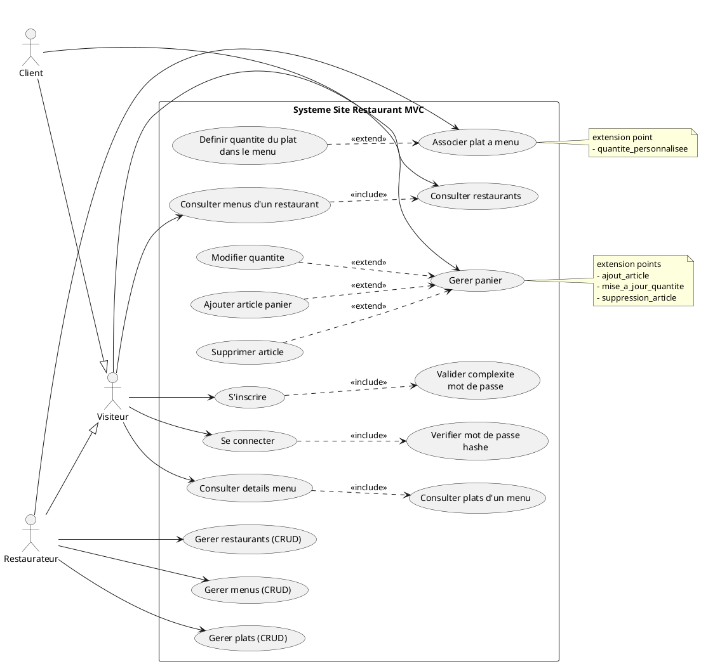
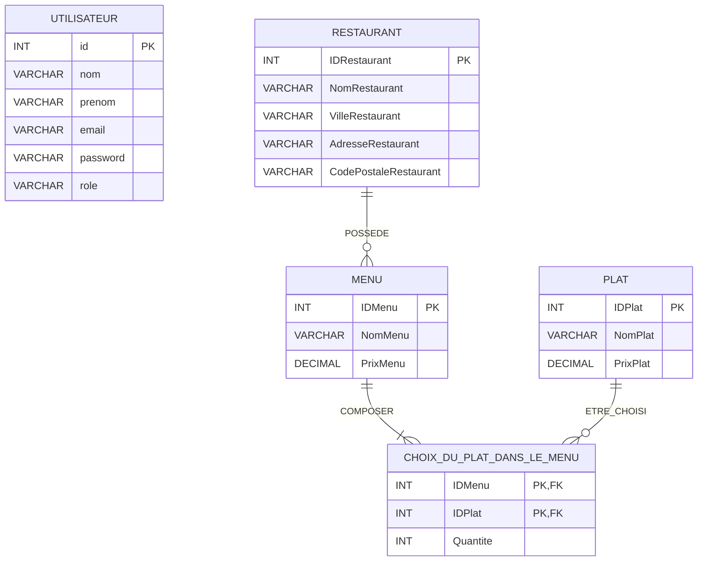

# Dossier E6 - Use Case et MCD

## 1) Diagramme de cas d'utilisation (Use Case)

Objectif : representer les acteurs, les cas metier, et les relations <<include>> / <<extend>> comme sur ton exemple.

Acteurs retenus :

- Visiteur
- Client (heritage de Visiteur)
- Restaurateur (heritage de Visiteur)

## 2) MCD (Merise)

Objectif : representer les entites, associations et cardinalites conformes aux exigences E6.

### Entites

- UTILISATEUR(id, nom, prenom, email, password, role)
- RESTAURANT(IDRestaurant, NomRestaurant, VilleRestaurant, AdresseRestaurant, CodePostaleRestaurant)
- MENU(IDMenu, NomMenu, PrixMenu)
- PLAT(IDPlat, NomPlat, PrixPlat)

### Associations et cardinalites

- POSSEDE entre RESTAURANT et MENU
  - RESTAURANT (1,1)
  - MENU (0,N)
- COMPOSER entre MENU et PLAT, porteuse de donnee Quantite
  - MENU (1,N)
  - PLAT (0,N)
  - attribut d'association : Quantite

### Lecture rapide du MCD

- Un restaurant propose zero a plusieurs menus, et chaque menu est rattache a un restaurant.
- Un menu contient un ou plusieurs plats.
- Un plat peut apparaitre dans zero a plusieurs menus.
- La quantite est portee par l'association entre menu et plat.
