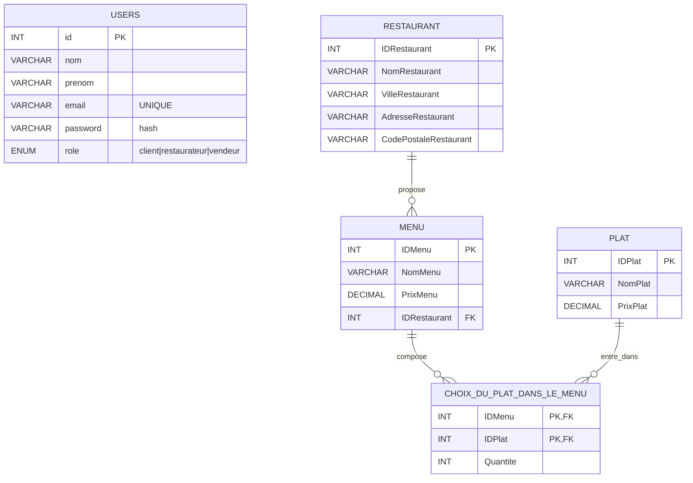
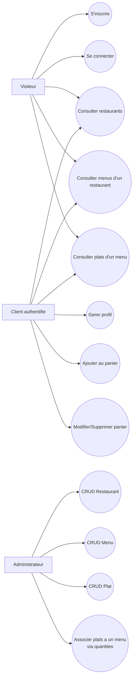

# Dossier E6 - MCD et Use Case

## Contexte
Application web MVC de gestion de restaurants, menus et plats, avec authentification utilisateur.

## Exigences E6 couvertes
- Base relationnelle avec jeu d'essai realistie
- Association 1,1 vers 1,N : Restaurant -> Menu
- Association 1,N vers 1,N porteuse de donnees : Menu <-> Plat via Choix_du_plat_dans_le_menu (Quantite)
- CRUD : Restaurant, Menu, Plat
- Inscription avec complexite du mot de passe
- Connexion avec mot de passe chiffre (hash)

## MCD (Merise)

Cardinalites Merise :
- RESTAURANT (1,1) - possede - MENU (0,N)
- MENU (1,N) - contient - PLAT (0,N) via CHOIX_DU_PLAT_DANS_LE_MENU[Quantite]

## Use Case

## Traceabilite rapide vers le projet
- Schema SQL : database/schema_e6.sql
- Inscription/connexion : controllers/UserController.php et models/User.php
- CRUD Restaurant : controllers/RestaurantController.php
- CRUD Menu : controllers/MenuController.php
- CRUD Plat : controllers/PlatController.php
- Illustration 1,N vers 1,N : models/Plat.php (getByMenuId)
